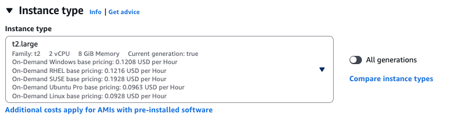
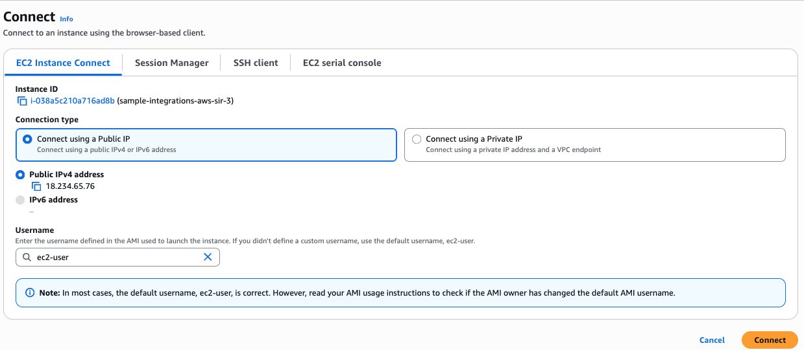

# ServiceNow Integration for AWS Security Incident Response

This document provides an overview of the AWS Security Incident Response ServiceNow integration, including its architecture, resources, parameters, and deployment instructions.

For quick reference, this is the deployment command that needs to be run.  For a step-by-step guide see the [Deployment](#deployment) 
section in this document.

```bash
# Deploy the integration with JWT OAuth authentication
./deploy-integrations-solution.py service-now \
  --instance-id <your-servicenow-instance-id> \
  --client-id <your-oauth-client-id> \
  --client-secret <your-oauth-client-secret> \
  --user-sys-id <your-servicenow-user-sys-id> \
  --private-key-path <path-to-private-key-file> \
  --integration-module <itsm|ir> \
  --log-level <info|error|debug>
```

Eg.
```bash
# Deploy the integration with JWT OAuth authentication
./deploy-integrations-solution.py service-now \
  --instance-id dev1234 \
  --client-id test-1234 \
  --client-secret "XXXXXXXXXXXXXXXXXXXX" \
  --user-sys-id a1b2c3d4e5f6g7h8i9j0k1l2m3n4o5p6 \
  --private-key-path private.key \
  --integration-module ir \
  --log-level info
```

## Deployment

Below is a step-by-step guide to deploy the ServiceNow Integration.

### Integration Module Options

- **`itsm`**: IT Service Management module - Uses standard ServiceNow incident table (`incident`)
- **`ir`**: Incident Response module - Uses ServiceNow Security Incident Response table (`sn_si_incident`)

See the Prerequisites section below for instructions on how to obtain your ServiceNow instance id, username and password, configure aws profile, and install necessary tools required to deploy the integration.

## Authentication Methods

The ServiceNow integration now uses **JWT OAuth authentication** for enhanced security. This method eliminates the need for password management and provides better security through RSA key-based authentication.

### JWT OAuth Authentication (Recommended)

JWT (JSON Web Token) OAuth authentication uses RSA key pairs to generate signed tokens for ServiceNow API access. This method provides:

- **Enhanced Security**: No password storage or transmission
- **Token-based Access**: Short-lived access tokens (1 hour expiration)
- **Key-based Signing**: RSA private/public key pair authentication
- **Automatic Token Refresh**: Tokens are regenerated as needed

#### Benefits of JWT OAuth:
- Eliminates password management overhead
- Provides audit trail through OAuth application logs
- Supports automatic token rotation
- Follows ServiceNow security best practices
- Reduces credential exposure risk

**Note:** With JWT OAuth authentication, you no longer need to manage passwords for the integration user. Creating a non-person entity (NPE) orphaned from a User enables the NPE to not be tied to a person that may leave the organization.

## Prerequisites

### Identify Your ServiceNow Instance ID

1. Open your ServiceNow instance in a web browser
2. Look at the URL in your browser's address bar
3. The instance ID is the subdomain part of the URL

**Example:**
- URL: `https://dev12345.service-now.com`
- Instance ID: `dev12345`

### Setup ServiceNow Integration User

1. Log in to your ServiceNow instance as an administrator
2. Navigate to **User Administration** > **Users**
3. If you do not have a user, click "New" to create a new user
   1. Fill in the required fields:
      - User ID: `aws_integration` (recommended)
      - First Name: `AWS`
      - Last Name: `Integration`
4. If you have a user, search with user-id and open the record
5. Copy the user's `Sys ID`  

6. Assign the following roles under the `Roles` tab by clicking on `Edit`:
   
   **ITSM Mode (incident table):**
   - `itil` (Base ITIL role - grants read/write access to incident table)
   
   **IR Mode (sn_si_incident table):**
   - `sn_si.analyst` (for performing operations on Security Incidents)
   - `sn_si.basic` (for performing operations on Security Incidents)
   - `sn_si.external` (for performing operations on Security Incidents)
   - `sn_si.integration_user` (for performing operations on Security Incidents)
   - `sn_si.manager` (for performing operations on Security Incidents)
   - `sn_si.read` (for performing operations on Security Incidents)
   
   **Common roles (both modes):**
   - `rest_api_explorer` (or a custom role with permissions to create `Outbound REST Message`)
   - `web_service_admin` (or a custom role with permissions to create `Outbound REST Message`)
   - `business_rule_admin` (for performing operations on `Business Rules`)
   - `incident_manager` (for performing operations on Incidents)
   - `snc_internal` (ServiceNow internal role)
   - `credential_admin` (for storing the sensitive APIKey as a `discovery_credential` encrypted password)

### Retrieve aws credentials for configuring profile

1. `AWS Access Key ID`
2. `AWS Secret Access Key`
3. `AWS Session Token`

### Bootstrap environment
If you haven't already performed a `cdk bootstrap` on your AWS account, run the following command either via an EC2 instance or local terminal as seen in the next i.e. [Install the necessary tools](#install-the-necessary-tools) section:

**Recommended: Use least-privilege bootstrap policy**

For enhanced security, use the least-privilege CDK bootstrap policy that restricts permissions to only the AWS services required by this solution. See the detailed policy and instructions in [CDK_BOOTSTRAP_POLICY.md](CDK_BOOTSTRAP_POLICY.md).

**Alternative: Use default bootstrap (less secure)**
```bash
cdk bootstrap
```

**Why to bootstrap?**
Bootstrap is a prerequisite to deployment. You cannot deploy the solution which is a CDK application into an AWS account and region (an "environment") until that environment has been bootstrapped. Trying to deploy without bootstrapping will result in an error. Performing `cdk bootstrap` on an environment allows you to provision the foundational resources (like an S3 bucket and IAM roles) that the AWS CDK needs to manage and deploy the solution's infrastructure. 

### Install the necessary tools

#### Using AWS Console (EC2 instance)

1. Navigate to EC2 in AWS Console
2. Launch a new instance
   1. Provide any `Name`
   2. Keep the **default** settings for `Application and OS images`:
      1. Keep the **default** `Amazon Linux` OS
      2. Keep the **default**, Free tier eligible AMI - `Amazon Linux 2023 kernel-6.1 AMI`
         
   3. In `Instance type`:
      1. Select `t2.xlarge`
         
   4. In `Key pair`, either select an existing key pair from the drop down or create a new one:
         
   5. Keep everything else as **default**
   6. Click on `Launch Instance`
3. Once the instance is up and running, select the instance and click on `Connect`. Then, connect using `EC2 Instance Connect`:
      
4. Once connected, simply copy and paste the following set of commands:
   ```
   sudo yum install git -y
   sudo yum install docker
   sudo yum install openssl
   sudo yum install -y nodejs
   sudo npm install -g aws-cdk
   node -v
   npm -v
   npx -v
   sudo yum install python3 python3-pip -y
   git clone https://github.com/aws-samples/sample-aws-security-incident-response-integrations.git
   cd sample-aws-security-incident-response-integrations/
   pip install -r requirements.txt
   chmod +x deploy-integrations-solution.py
   sudo systemctl start docker.service
   sudo chmod 666 /var/run/docker.sock
   ```
5. Generate X.509 Public Certificate and Private Key using `openssl`
   1. Generate a private key using RSA 2048 algorithm to be used for ServiceNow cdk deployment and OAuth:
      ```bash
      openssl genrsa -out private.key 2048
      ```
   2. Generate a self-signed x509 certificate:
      ```bash
      openssl req -new -x509 -key private.key -out publickey.cer -days 3650
      ```
6. Open `publickey.cer` using the command `vi publickey.cer`, and copy the contents of the certificate
7. Follow the steps in [Upload/Add the X.509 Certificate in ServiceNow](#uploadadd-the-x509-certificate-in-servicenow) section to create a new certificate in ServiceNow using the copied contents from the previous step
8. Follow the steps in [Configure OAuth Client Application in ServiceNow](#configure-oauth-client-application-in-servicenow) to create a new client application that will be used to perform the JWT OAuth.
9. In the EC2 instance, configure aws credentials. Provide the `AWS Access Key ID`, `AWS Secret Access Key` and `AWS Session Token` when prompted:
   ```
   export AWS_ACCESS_KEY_ID=<AWS Access Key ID>
   export AWS_SECRET_ACCESS_KEY=<AWS Secret Access Key>
   export AWS_SESSION_TOKEN=<AWS Session Token>
   ```
10. Now, run the `deploy` command from the [Deployment](#deployment) section

    **Note:** It may take 2-4 minutes after deployment completion to start seeing synchronization of new incidents between ServiceNow and AWS Security Incident Response.

#### Using local terminal instance

1. Open a new Terminal session
2. Copy and paste the following set of commands:
   ```
   sudo yum install git -y
   sudo yum install docker
   sudo yum install openssl
   sudo yum install -y nodejs
   sudo npm install -g aws-cdk
   node -v
   npm -v
   npx -v
   sudo yum install python3 python3-pip -y
   git clone https://github.com/aws-samples/sample-aws-security-incident-response-integrations.git
   cd sample-aws-security-incident-response-integrations/
   pip install -r requirements.txt
   chmod +x deploy-integrations-solution.py
   sudo systemctl start docker.service
   sudo chmod 666 /var/run/docker.sock
   ```
3. Generate X.509 Public Certificate and Private Key using `openssl`
   1. Generate a private key using RSA 2048 algorithm to be used for ServiceNow cdk deployment and OAuth:
      ```bash
      openssl genrsa -out private.key 2048
      ```
   2. Generate a self-signed x509 certificate:
      ```bash
      openssl req -new -x509 -key private.key -out publickey.cer -days 3650
      ```
4. Open `publickey.cer` using the command `vi publickey.cer`, and copy the contents of the certificate
5. Follow the steps in [Upload/Add the X.509 Certificate in ServiceNow](#uploadadd-the-x509-certificate-in-servicenow) section to create a new certificate in ServiceNow using the copied contents from the previous step
6. Follow the steps in [Configure OAuth Client Application in ServiceNow](#configure-oauth-client-application-in-servicenow) to create a new client application that will be used to perform the JWT OAuth.
7. In the local instance, configure aws credentials. Provide the `AWS Access Key ID`, `AWS Secret Access Key` and `AWS Session Token` when prompted:
   ```
   export AWS_ACCESS_KEY_ID=<AWS Access Key ID>
   export AWS_SECRET_ACCESS_KEY=<AWS Secret Access Key>
   export AWS_SESSION_TOKEN=<AWS Session Token>
   ```
8. Now, run the `deploy` command from the [Deployment](#deployment) section

   **Note:** It may take 2-4 minutes after deployment completion to start seeing synchronization of new incidents between ServiceNow and AWS Security Incident Response.

## Configure OAuth in ServiceNow

### Upload/Add the X.509 Certificate in ServiceNow

1. Navigate to **System Definition** > **Certificates**
2. Click **New** to create a new certificate record
3. Fill in the required fields:
   - **Name**: `AWS Security IR Integration Certificate`
   - **Format**: `PEM`
   - **Type**: `Trust Store Certificate`
4. In the **PEM Certificate** field, paste the contents copied in the previous section from `publickey.cer`
5. Save the certificate record

6. On the **System Definition** > **Certificates**, you can get the **Sys ID*. Save the **Sys ID** for latest


### Configure OAuth Client Application in ServiceNow

1. Navigate to **System OAuth > Application Registry**
2. Click **New** and select **[Deprecated UI] Create an OAuth JWT API endpoint for external clients**
3. Fill in the required fields:
   - **Name**: `AWS Security Incident Response Integration`
   - **Client ID**: Generate or provide a unique client ID
   - **Client Secret**: Generate a secure client secret
   - **Accessible From**: `All application scopes`
   - **Active**: ✅
   - **Access Token Lifespan**: `3600`
   - **Clock skew**: `300`
   - **Token Format**: `Opaque`
   - **User field**: `Sys ID` ## user_name is no longer the recommended approach. Please use Sys ID.
   - **Enable JTI verification**: ✅
   - **JTI Claim**: `jti`
   - **JWKS Cache Lifespan**: `720`
  
4. Under the **Auth Scopes** section:
   1. Select or Create a new Auth Scope
   

      
5. Click Submit to create the Application Registry
6. Navigate to the `AWS Security Incident Response Integration` entry that was just created under Application Registry.
7. Under the **JWT Verifier Maps** section:
   1. Click on New
   2. Enter the following details
      - **Name**: `AWS Security Incident Response Integration JWT Verifier`
      - **Sys certificate**: Click on the `Search` icon and select the `x.509` certificate created in the previous steps
   
   
8. Save the application.
9. Note the **Client ID** and **Client Secret** as it will be needed for deployment

**Security Note:** Keep the private key secure and never commit it to version control.

**Best Practice:** Create a dedicated service account rather than using a personal account.

### Securing Your Credentials

The deployment script automatically will store your credential in secure storage using AWS Secrets Manager.

### Customizing Lambda Configuration

**Note:** Lambda configurations such as `API_KEY_ROTATION_SCHEDULE_DURATION`, `LAMBDA_MEMORY_SIZE`, and `LAMBDA_TIMEOUT_MINUTES` can be customized by modifying the `aws_security_incident_response_sample_integrations/constants.py` file before deployment. For example, to change the API key rotation schedule from the default 30 days to 60 days, update:

```python
API_KEY_ROTATION_SCHEDULE_DURATION = Duration.days(60)
```

### Deploy

Now that you have all the necessary data for deployment see [Deployment](#Deployment) section. You can confirm you all the
data you need below in the [Parameters](#parameters) section.

## Parameters

The ServiceNow integration stack requires the following parameters during deployment:

| Parameter | Description                                                   | Type                                                     | Required                                             | Example                                                    |
|-----------|---------------------------------------------------------------|----------------------------------------------------------|------------------------------------------------------|------------------------------------------------------------|
| `serviceNowInstanceId` | The ServiceNow instance ID (subdomain of your ServiceNow URL) | String                                                   | Yes                                                  | `dev12345` (from dev12345.service-now.com)                 |
| `serviceNowClientId` | The OAuth client ID from ServiceNow OAuth application         | String                                                   | Yes                                                  | `abc123def456`                                             |
| `serviceNowClientSecret` | The OAuth client secret from ServiceNow OAuth application     | String                                                   | Yes                                                  | `********`                                                 |
| `serviceNowUserId` | The ServiceNow user's sys-id for JWT authentication. | String | Yes | `8b3fede183cbfe90e020f7a6feaad387`                           |
| `privateKeyAssetPath` | Local path to the RSA private key file for JWT signing        | String                                                   | Yes                                                  | `./private.key`                                            |
| `integrationModule` | ServiceNow integration module type                            | String                                                   | Yes                                                  | `itsm` (IT Service Management) or `ir` (Incident Response) |
| `logLevel` | The log level for Lambda functions                            | String                                                   | No                                                   | `info`, `debug`, or `error` (default)                      |

## Post Deployment Verification

### Test AWS to ServiceNow Flow
1. Create a test case in AWS Security Incident Response
2. Verify the incident appears in ServiceNow with correct details
3. Add comments and attachments to the Security IR case
4. Confirm they synchronize to the ServiceNow incident

### Test ServiceNow to AWS Flow
1. Create a test incident in ServiceNow
2. Verify a corresponding case is created in AWS Security Incident Response
3. Update the ServiceNow incident (status, comments, attachments)
4. Confirm changes synchronize to the Security IR case

### Verify Business Rules
1. Navigate to **System Definition > Business Rules** in ServiceNow
2. Search for rules with your resource prefix
3. Verify both incident and attachment business rules are active
4. Test rule execution by creating/updating incidents and attachments

## Architecture

The ServiceNow integration for AWS Security Incident Response enables bidirectional communication between AWS Security Incident Response and ServiceNow. This allows security incidents to be synchronized between both systems in real-time.

### Integration Overview

```
┌─────────────────┐                  ┌────────────────┐                  ┌─────────────┐
│                 │                  │                │                  │             │
│  AWS Security   │◄─── Updates ────►│   EventBridge  │◄─── Updates ────►│  ServiceNow │
│  Incident       │                  │   Event Bus    │                  │  Instance   │
│  Response       │                  │                │                  │             │
│                 │                  │                │                  │             │
└─────────────────┘                  └────────────────┘                  └─────────────┘
        ▲                                    ▲                                 ▲
        │                                    │                                 │
        │                                    │                                 │
        ▼                                    ▼                                 ▼
┌─────────────────┐                  ┌────────────────┐                  ┌─────────────┐
│                 │                  │                │                  │             │
│  Security IR    │                  │  ServiceNow    │                  │  ServiceNow │
│  Client Lambda  │                  │  Client Lambda │                  │  Webhook    │
│                 │                  │                │                  │  (API GW)   │
│                 │                  │                │                  │             │
└─────────────────┘                  └────────────────┘                  └─────────────┘
```

### Integration Flow

The ServiceNow integration follows a similar pattern to the Jira integration, but with some key differences in implementation:

#### Flow 1: AWS Security Incident Response to ServiceNow

1. The **Security IR Poller Lambda** polls for incidents from AWS Security Incident Response
2. Events are published to EventBridge
3. The **ServiceNow Client Lambda** processes these events
4. The ServiceNow Client Lambda updates or creates incidents in ServiceNow via the ServiceNow API

#### Flow 2: ServiceNow to AWS Security Incident Response

1. ServiceNow incidents trigger a **Business Rule** when created, updated, or closed
2. The Business Rule sends the incident data to an **API Gateway webhook endpoint**
3. The **ServiceNow Notifications Handler Lambda** processes the webhook request and publishes events to EventBridge
4. The **Security IR Client Lambda** subscribes to these events and performs the appropriate operations in AWS Security Incident Response

#### Automatic ServiceNow Setup

The integration includes a **ServiceNow Resource Setup Lambda** that automatically configures the necessary components in ServiceNow during deployment:
- Business Rules for incident events
- Outbound REST Messages for API communication
- Script Includes for data formatting


## Resources

### AWS Resources

The ServiceNow integration stack creates the following AWS resources:

### Lambda Functions

1. **ServiceNow Client Lambda** (`SecurityIncidentResponseServiceNowClient`)
   - Processes events from AWS Security Incident Response
   - Creates or updates incidents in ServiceNow
   - Timeout: 15 minutes

2. **ServiceNow Notifications Handler Lambda** (`ServiceNowNotificationsHandler`)
   - Processes webhook events from ServiceNow
   - Publishes events to EventBridge

3. **ServiceNow Resource Setup Lambda** (`ServiceNowResourceSetupLambda`)
   - Sets up required resources in ServiceNow during deployment:
     - **Business Rules**: Creates or updates business rules in ServiceNow that trigger when incidents are created, updated, or deleted
     - **Outbound REST Messages**: Configures REST messages that send incident data to the API Gateway webhook
   - Automatically configures the webhook URL in ServiceNow to point to the API Gateway endpoint
   - Runs as a Custom Resource during CloudFormation deployment
   - Timeout: 5 minutes
   - Uses the ServiceNow API to create these components programmatically
   - Uses the API Gateway's REST API ID as a prefix for ServiceNow resource names
   - Environment variables include:
     - `SERVICE_NOW_INSTANCE_ID`: SSM parameter name for the ServiceNow instance ID
     - `SERVICE_NOW_USER`: SSM parameter name for the ServiceNow user
     - `SERVICE_NOW_PASSWORD_PARAM`: SSM parameter name for the ServiceNow password
     - `SERVICE_NOW_RESOURCE_PREFIX`: API Gateway REST API ID
     - `WEBHOOK_URL`: Complete URL for the webhook endpoint
     - `LOG_LEVEL`: Log level for the Lambda function

### API Gateway

- **ServiceNow Webhook API** (`ServiceNowWebhookApi`)
  - Provides an endpoint for ServiceNow to send events
  - Supports POST method (OPTIONS method is automatically added by CORS configuration)
  - Integrates with the ServiceNow Notifications Handler Lambda
  - Configured with CORS support for all origins and methods

### EventBridge Rules

1. **Service Now Client Rule** (`service-now-client-rule`)
   - Captures events from AWS Security Incident Response
   - Triggers the ServiceNow Client Lambda

2. **ServiceNow Notifications Rule** (`ServiceNowNotificationsRule`)
   - Captures events from ServiceNow
   - Logs events to CloudWatch

### SSM Parameters

- `/SecurityIncidentResponse/serviceNowInstanceId`
- `/SecurityIncidentResponse/serviceNowClientId`
- `/SecurityIncidentResponse/serviceNowClientSecret`
- `/SecurityIncidentResponse/serviceNowUserId`
- `/SecurityIncidentResponse/privateKeyAssetBucket`
- `/SecurityIncidentResponse/privateKeyAssetKey`

### IAM Roles

- Custom roles for each Lambda function with least privilege permissions

### DynamoDB Table

- Uses a shared table from the common stack to store incident mapping information

### ServiceNow Resources

The ServiceNow Resource Setup Lambda creates the following components in your ServiceNow instance:

1. **Business Rules**:
   - **Incident Business Rule**: Triggers when incidents are created, updated, or deleted in ServiceNow
     - Monitors the `incident` table
     - Sends `IncidentCreated` or `IncidentUpdated` events to AWS
     - Includes incident number and system ID in the payload
   - **Attachment Business Rule**: Triggers when attachments are added, updated, or deleted on incidents
     - Monitors the `sys_attachment` table for incident-related attachments
     - Sends `IncidentUpdated` events when attachment changes occur
     - Includes attachment action type (added/updated/deleted) in the payload
     - Only processes attachments related to the incident table
   - Rules are prefixed with the resource prefix for easy identification

2. **Outbound REST Messages**:
   - **Primary REST Message**: Handles incident and attachment event notifications
   - **HTTP POST Function**: Configured to send JSON payloads to the API Gateway webhook
   - **Authorization Headers**: Automatically configured with Bearer token authentication
   - **Request Parameters**: Dynamically configured based on the event payload structure

3. **Authentication**:
   - **API Gateway Secret**: Stored in AWS Secrets Manager for secure webhook authentication
   - **Automatic Token Rotation**: Supports token rotation via AWS Secrets Manager
   - **Bearer Token Authentication**: Used for all webhook requests to AWS

## Key Features

### Bidirectional Synchronization
- **AWS to ServiceNow**: Security IR cases automatically create/update ServiceNow incidents
- **ServiceNow to AWS**: ServiceNow incident changes trigger updates in Security IR cases
- **Real-time Updates**: Event-driven architecture ensures near-instantaneous synchronization

### Attachment Handling
- **Size Limits**: Attachments larger than 5MB are handled via comments with download instructions
- **Duplicate Prevention**: Checks for existing attachment comments before adding new ones
- **Error Handling**: Failed uploads result in informative comments with fallback instructions
- **Bidirectional Sync**: Attachments are synchronized in both directions when possible

### Comment Synchronization
- **Bidirectional Comments**: Comments are synchronized between both systems
- **Duplicate Prevention**: Prevents duplicate comments using content matching
- **Update Tags**: Uses system tags to identify and skip system-generated updates
- **Rich Content**: Supports formatted comments and work notes

### Status Mapping
- **Intelligent Mapping**: Maps Security IR case statuses to appropriate ServiceNow incident states
- **Workflow Support**: Handles ServiceNow workflow transitions automatically
- **Closure Handling**: Properly manages incident closure and resolution codes

## Troubleshooting

For detailed troubleshooting information, common issues, and diagnostic steps, please refer to the [ServiceNow Integration Troubleshooting Guide](SERVICE_NOW_TROUBLESHOOTING.md).

## Security Considerations

### Credential Management
- ServiceNow OAuth credentials are stored securely in SSM Parameter Store
- RSA private key for JWT signing is stored as an S3 asset and referenced via SSM parameters
- API Gateway authentication tokens are managed via AWS Secrets Manager
- Automatic token rotation is supported for enhanced security
- JWT tokens are generated dynamically with short expiration times (1 hour)

### Network Security
- All communications use HTTPS/TLS encryption
- API Gateway endpoints are secured with custom authorizers
- ServiceNow webhook requests include proper authentication headers

### Access Control
- Lambda functions use least-privilege IAM roles
- ServiceNow integration user should have minimal required permissions
- OAuth application in ServiceNow provides secure API access without password management
- RSA key-based JWT authentication ensures secure token generation
- DynamoDB access is restricted to specific table operations

## Advanced Configuration

### Custom Field Mapping
Modify the `service_now_sir_mapper.py` file to customize field mappings between ServiceNow and Security IR:

```python
FIELD_MAPPING = {
    "short_description": "title",
    "description": "description",
    "comments_and_work_notes": "caseComments",
    # Add custom field mappings here
}
```

### Status Mapping Customization
Update the status mapping in `service_now_sir_mapper.py`:

```python
STATUS_MAPPING = {
    "Detection and Analysis": "2",  # In Progress
    "Containment, Eradication and Recovery": "2",  # In Progress
    "Post-incident Activities": "2",  # In Progress
    "Closed": "7",  # Closed
    # Add custom status mappings here
}
```

### Business Rule Customization
The ServiceNow business rules can be customized after deployment by modifying them directly in ServiceNow or by updating the `service_now_resource_setup_handler` code and redeploying.

## Additional Resources

- [ServiceNow Integration Troubleshooting Guide](SERVICE_NOW_TROUBLESHOOTING.md) - Comprehensive troubleshooting, validation, and diagnostic information
- [AWS Security Incident Response Documentation](https://docs.aws.amazon.com/security-ir/) - Official AWS Security Incident Response service documentation
- [ServiceNow REST API Documentation](https://docs.servicenow.com/bundle/vancouver-application-development/page/integrate/inbound-rest/concept/c_RESTAPI.html) - ServiceNow REST API reference identification

2. **Outbound REST Messages**:
   - **AWS Security IR Integration Message**: Configured to send incident data to the API Gateway webhook URL
   - Includes authentication and proper formatting of the payload
   - Automatically updated if the webhook URL changes during redeployment

3. **Script Includes**:
   - Helper scripts to format incident data for transmission to AWS
   - Handles error conditions and logging

All these components work together to ensure real-time synchronization between ServiceNow incidents and AWS Security Incident Response cases.

## Outputs

The stack provides the following outputs that can be used for integration:

| Output | Description | Usage |
|--------|-------------|-------|
| `ServiceNowClientLambdaArn` | ARN of the ServiceNow Client Lambda function | Reference for other AWS resources |
| `ServiceNowWebhookUrl` | URL of the API Gateway webhook endpoint | Configure in ServiceNow to send events to AWS |

## Setup and Configuration Summary

1. **Prepare ServiceNow**:
   - Ensure you have a ServiceNow instance with admin access
   - Create a dedicated service account for the integration if needed

2. **Install the required tooling**
   - Ensure you have executed the set of commands to install the necessary tooling required to perform the deployment of the integration
   - You can do so either in AWS Console via an EC2 instance or in local bash/terminal
  
3. **Deploy the Stack**:
   ```bash
   # Using the deploy-integrations-solution script with JWT OAuth
   deploy-integrations-solution service-now \
     --instance-id <your-servicenow-instance-id> \
     --client-id <your-oauth-client-id> \
     --client-secret <your-oauth-client-secret> \
     --user-sys-id <your-servicenow-user-sys-id> \
     --private-key-path <path-to-private-key-file> \
     --integration-module <itsm|ir> \
     --log-level info
   ```
   
   **Required Parameters:**
   - `--client-id`: OAuth client ID from ServiceNow OAuth application
   - `--client-secret`: OAuth client secret from ServiceNow OAuth application  
   - `--user-sys-id`: ServiceNow user's `sys-id` for JWT authentication
   - `--private-key-path`: Path to RSA private key file for JWT signing
   - `--integration-module`: Choose `itsm` for IT Service Management or `ir` for Incident Response module
   
   **Optional Parameters:**
   - `--log-level`: Defaults to `error`. Valid values are `info`, `debug`, and `error`

4. **Automatic Configuration**:
   - The ServiceNow Resource Setup Lambda will automatically:
     - Create business rules in ServiceNow to detect incident changes
     - Configure outbound REST messages to send data to the API Gateway
     - Set up the webhook URL in ServiceNow

5. **Verify the Setup**:
   - Check CloudFormation outputs for the webhook URL
   - Verify in ServiceNow that the business rules and outbound REST messages were created
   - The business rules will be prefixed with the Lambda function name for easy identification

6. **Test the Integration**:
   - Create a test incident in ServiceNow
   - Verify that the incident appears in AWS Security Incident Response
   - Update the incident in AWS and verify the changes appear in ServiceNow

## Troubleshooting and Validation

For detailed information on outputs, validation, troubleshooting, and security considerations, please refer to the [ServiceNow Troubleshooting Guide](SERVICE_NOW_TROUBLESHOOTING.md).

## Frequently Asked Questions

### General Questions

**Q: How long does it take for changes to sync between systems?**  
A: Changes typically sync within seconds. The integration uses event-driven architecture to ensure near real-time updates.

**Q: Can I customize which incidents are synchronized?**  
A: Yes, you can modify the ServiceNow business rules created by the integration to filter incidents based on criteria like priority or assignment group.

**Q: What happens if the integration fails?**  
A: The integration includes error handling and dead-letter queues. Failed events are stored and can be reprocessed. CloudWatch alarms will notify you of failures.

**Q: Does this integration support custom fields?**  
A: The base integration supports standard ServiceNow incident fields. For custom fields, you'll need to modify the Lambda functions and ServiceNow scripts.

**Q: Can I use this with ServiceNow's Security Incident Response module?**  
A: Yes, the integration supports ServiceNow's Security Incident Response module. Use `--integration-module ir` during deployment to target the `sn_si_incident` table instead of the standard `incident` table.

### Technical Questions

**Q: What permissions are required in ServiceNow?**  
A: The integration user needs admin access to create business rules and REST messages, plus access to incident records. Additionally, you need to configure an OAuth application with the appropriate public key for JWT verification.

**Q: How are credentials stored?**  
A: ServiceNow OAuth credentials are stored in AWS Systems Manager Parameter Store with secure string parameters. The RSA private key for JWT signing is stored as an S3 asset with references in SSM parameters.

**Q: Can I deploy multiple integrations to different ServiceNow instances?**  
A: Yes, you can deploy the stack multiple times with different parameters to connect to different ServiceNow instances.

## Related Resources

- [AWS Security Incident Response Documentation](https://docs.aws.amazon.com/security-ir/)
- [ServiceNow API Documentation](https://developer.servicenow.com/dev.do)
- [ServiceNow Business Rules Documentation](https://docs.servicenow.com/bundle/tokyo-application-development/page/script/business-rules/concept/c_BusinessRules.html)
- [AWS EventBridge Documentation](https://docs.aws.amazon.com/eventbridge/)
